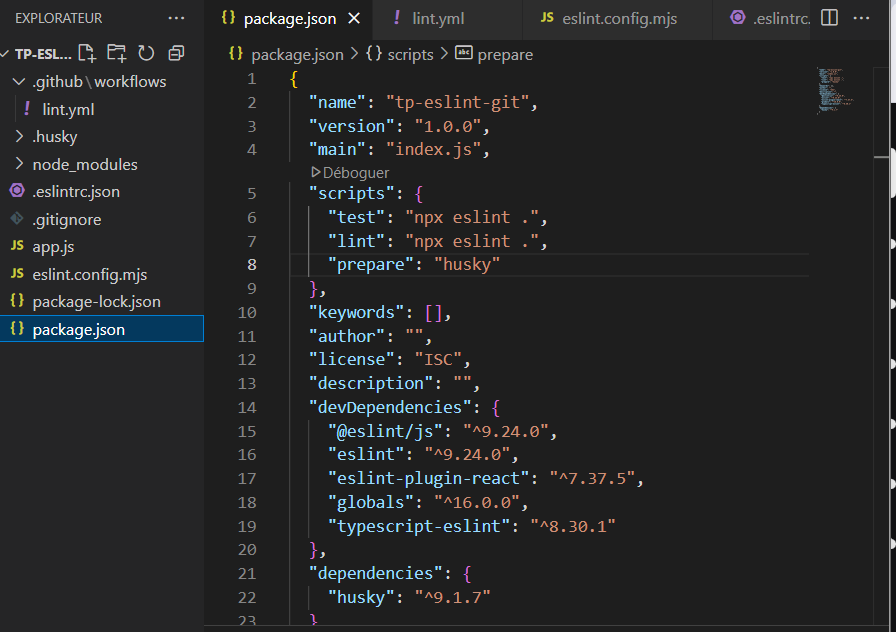

# Compte Rendu – TP Git / ESLint / Husky / GitHub Actions

## I. Git – Commandes de base

1. Les commandes ont été exécutées avec succès.
2. Commande Git exécutée correctement.
3. Deuxième commande Git exécutée.
4. Le fichier `.gitignore` a bien été créé et modifié.

## II. ESLint – Configuration de base

1. Le fichier `app.js` a été créé.
2. La commande `npx eslint app.js` a retourné un **warning** mais **aucune erreur**.  
   Même après correction du code, aucun changement constaté.

## III. Husky – Hooks Git

1. Certaines commandes proposées n'ont pas fonctionné ; d'autres requêtes ont été nécessaires.
2. Un **hook pre-commit** a été ajouté manuellement.
3. `git add .` a fonctionné, mais il a fallu **modifier le `package.json`** pour pouvoir faire un commit.

## IV. ESLint – Configuration avancée

1. Le fichier `.eslintrc.json` a été modifié pour ajouter des règles personnalisées.
2. Un script `"lint"` a été ajouté dans `package.json`.
3. La commande `npm run lint` fonctionne correctement.

## V. GitHub – Dépôt & CI

1. Un dépôt GitHub a été créé.
2. Un **workflow GitHub Actions** a été ajouté dans `.github/workflows/lint.yml`.
3. Le commit a été validé et le `push` a été effectué avec succès.

---

# Compte Rendu – TP Git / ESLint / Husky / GitHub Actions

## I. Git – Commandes de base

1. Les commandes ont été exécutées avec succès.
2. Commande Git exécutée correctement.
3. Deuxième commande Git exécutée.
4. Le fichier `.gitignore` a bien été créé et modifié.

## II. ESLint – Configuration de base

1. Le fichier `app.js` a été créé.
2. La commande `npx eslint app.js` a retourné un **warning** mais **aucune erreur**.  
   Même après correction du code, aucun changement constaté.

## III. Husky – Hooks Git

1. Certaines commandes proposées n'ont pas fonctionné ; d'autres requêtes ont été nécessaires.
2. Un **hook pre-commit** a été ajouté manuellement.
3. `git add .` a fonctionné, mais il a fallu **modifier le `package.json`** pour pouvoir faire un commit.

## IV. ESLint – Configuration avancée

1. Le fichier `.eslintrc.json` a été modifié pour ajouter des règles personnalisées.
2. Un script `"lint"` a été ajouté dans `package.json`.
3. La commande `npm run lint` fonctionne correctement.

## V. GitHub – Dépôt & CI

1. Un dépôt GitHub a été créé.
2. Un **workflow GitHub Actions** a été ajouté dans `.github/workflows/lint.yml`.
3. Le commit a été validé et le `push` a été effectué avec succès.

---

